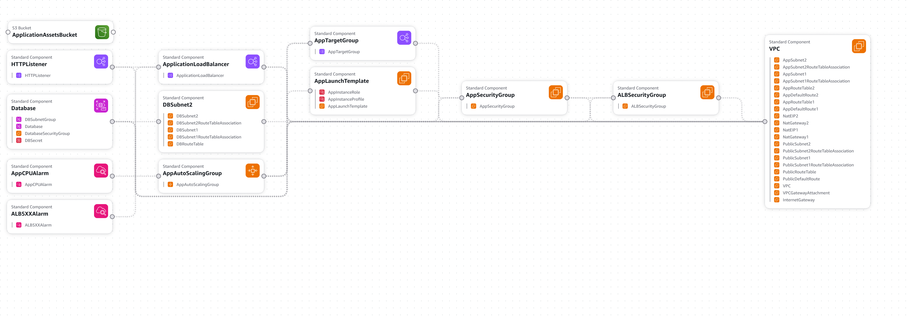

# 🚀 Highly Available 3-Tier Web Application on AWS

## 📌 Project Status

**Architecture Design & Infrastructure Showcase**

This project demonstrates the design of a Highly Available 3-Tier Web Application architecture on AWS using Infrastructure as Code concepts and AWS CloudFormation.

> AWS infrastructure deployment is planned as the next implementation phase.

AWS architecture and Infrastructure as Code showcase demonstrating the design of a Highly Available 3-Tier Web Application across multiple Availability Zones.

---

## ☁️ Project Overview

This project demonstrates how a scalable and highly available web application can be deployed on AWS using a secure 3-tier architecture.

### Architecture Layers

* 🌐 Presentation Layer — Application Load Balancer
* 💻 Application Layer — EC2 + Auto Scaling Group
* 🗄️ Database Layer — Amazon RDS (MySQL)
* 📦 Storage Layer — Amazon S3
* 📊 Monitoring — Amazon CloudWatch
* 🛠️ Infrastructure as Code — AWS CloudFormation

---

## 🛠️ AWS Services Used

| Service                   | Purpose                      |
| ------------------------- | ---------------------------- |
| Amazon VPC                | Networking                   |
| Public & Private Subnets  | Secure network segmentation  |
| Internet Gateway          | Public internet access       |
| NAT Gateway               | Internet for private subnets |
| Application Load Balancer | Traffic distribution         |
| EC2                       | Application servers          |
| Auto Scaling Group        | High Availability            |
| Amazon RDS                | MySQL Database               |
| Amazon S3                 | Static assets & storage      |
| IAM                       | Access management            |
| CloudWatch                | Monitoring                   |
| CloudFormation            | Infrastructure automation    |

---

## 📸 Project Screenshots

Project screenshots will be added after deployment.

---

## 🏗️ Architecture Diagram

Production-style Highly Available 3-Tier AWS Architecture.
---

## 📂 Project Structure

Project structure will be added in the next lesson.
